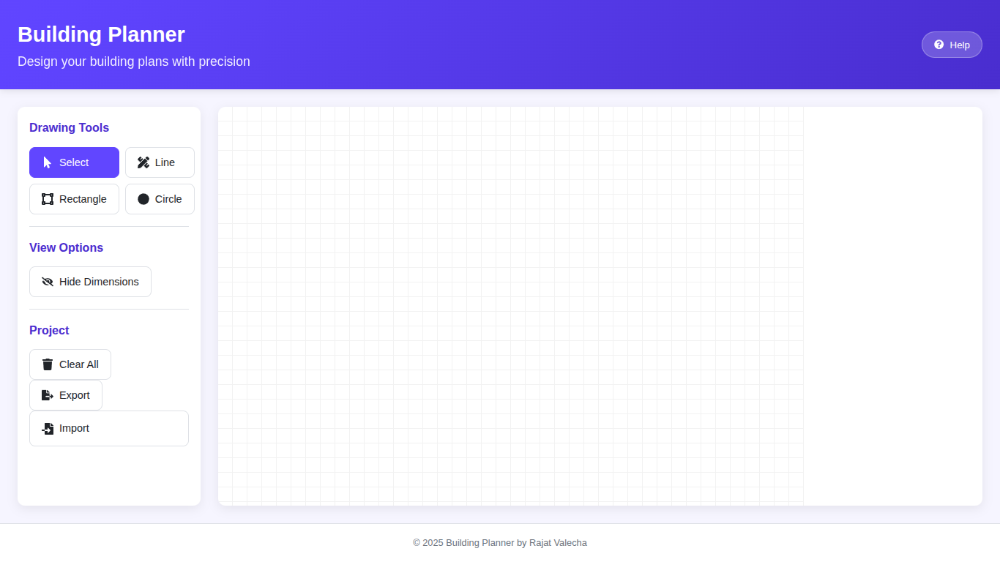

# Building Planner - Technical Documentation

## Project Overview

This web application allows users to create, edit, and annotate building plans with precision. Built with React and Vite, it features a clean interface with drawing tools, selection capabilities, and dimension annotations.

## Table of Contents
1. [Features](#features)
2. [Installation](#installation)
3. [Usage](#usage)
4. [Technical Implementation](#technical-implementation)
5. [Screenshots](#screenshots)
6. [Contributing](#contributing)

## Features

### Core Functionality
- **Drawing Tools**:
  - Lines (with adjustable endpoints)
  - Rectangles (resizable and rotatable)
  - Circles (adjustable radius)

- **Selection & Editing**:
  - Move, rotate, and resize shapes
  - Precise property editing via panel
  - Delete shapes with keyboard or UI

- **Annotations**:
  - Automatic dimension calculations
  - Toggle visibility of measurements
  - Real-time updates on edits

### Additional Features
- Project import/export (JSON)
- Responsive design (desktop & mobile)
- Comprehensive help system
- Grid background for precision

## Installation

```bash
# Clone repository
git clone https://github.com/rajat-valecha200/building-planner.git
cd building-planner

# Install dependencies
npm install

# Start development server
npm run dev

# Build for production
npm run build

# Preview production build
npm run preview
```

## Usage

### Basic Controls
1. **Drawing**:
   - Select tool → Click/drag on canvas
   - Shapes appear with automatic dimensions

2. **Editing**:
   - Click shape to select
   - Drag body to move
   - Drag rotation handle (top) to rotate
   - For lines: drag blue/red endpoints

3. **Annotations**:
   - Toggle via eye icon in toolbar
   - Dimensions update automatically

### Advanced Features
| Shortcut       | Action                     |
|----------------|----------------------------|
| Delete         | Remove selected shape      |
| Ctrl+Click     | Select multiple shapes     |
| Esc            | Deselect                   |

## Technical Implementation

### Architecture
```
src/
├── components/                 # All React components
│   ├── DrawingArea.jsx         # Main drawing canvas component
│   ├── Grid.jsx                # Grid background component
│   ├── Shape.jsx               # Individual shape rendering
│   ├── Toolbar.jsx             # Main toolbar container
│   ├── PropertiesPanel.jsx     # Main properties editor
│   ├── HelpButton.jsx          # Help trigger button
│   ├── HelpModal.jsx           # Interactive help modal
│   └── Shared/                 # Reusable components
│
├── utils/                      # Utility functions
│   ├── dimensionUtils.js       # Measurement calculations
│   └── exportUtils.js          # Import/export functionality
│
├── assets/                     # Static assets
│
├── App.jsx                     # Root application component
├── main.jsx                    # Application entry point
└── App.css                     # Global styles
```

### Key Technologies
- **Frontend**: React with Vite
- **State Management**: React hooks
- **Icons**: React Icons
- **Styling**: CSS with responsive design

### Coding Standards
- Functional components with hooks
- Proper component separation
- Descriptive prop types
- Meaningful variable names
- Consistent code formatting

## Screenshots

### Application Screenshots

1. **Canvas**  
   

2. **Canvas with drawing and labels**  
   

3. **Canvas with drawing and without labels**  
   

4. **Help View**  
   

## Contributing

1. Fork the repository
2. Create your feature branch (`git checkout -b feature/amazing-feature`)
3. Commit your changes (`git commit -m 'Add some amazing feature'`)
4. Push to the branch (`git push origin feature/amazing-feature`)
5. Open a Pull Request

---